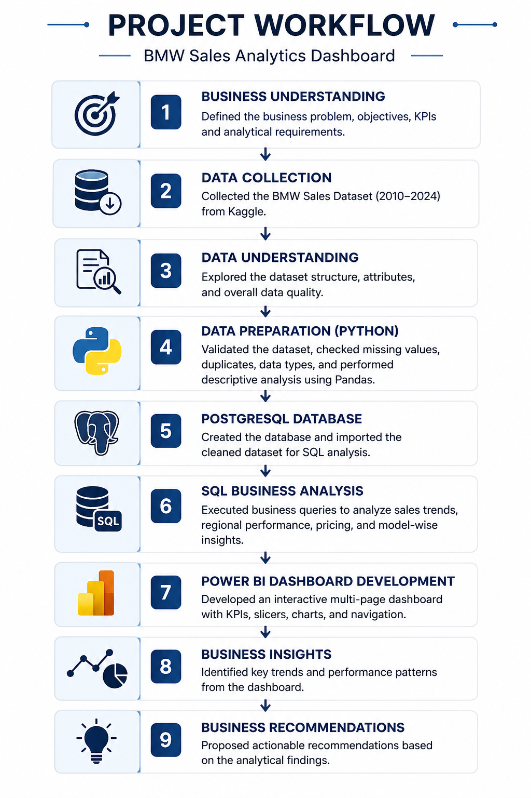
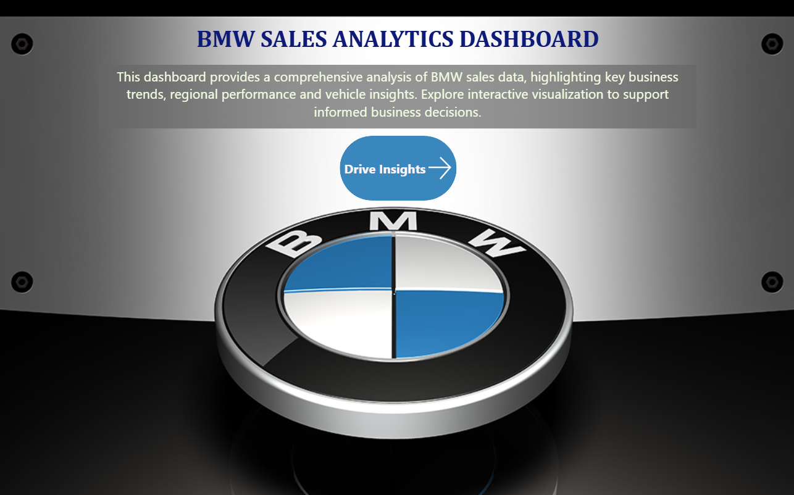
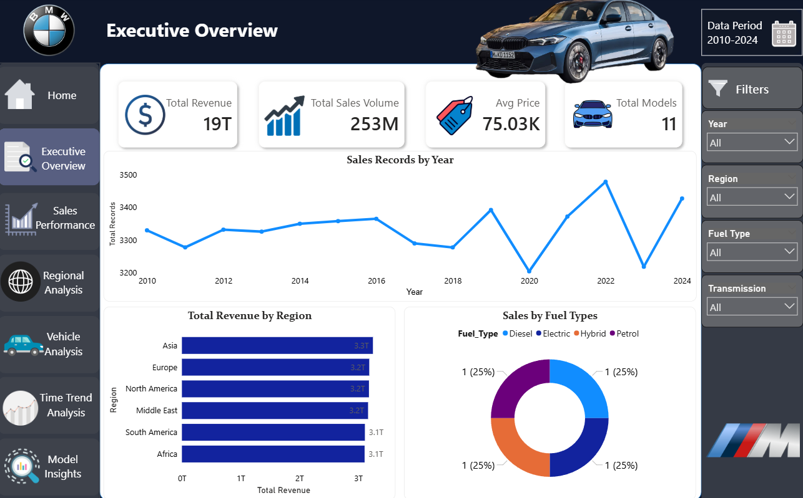
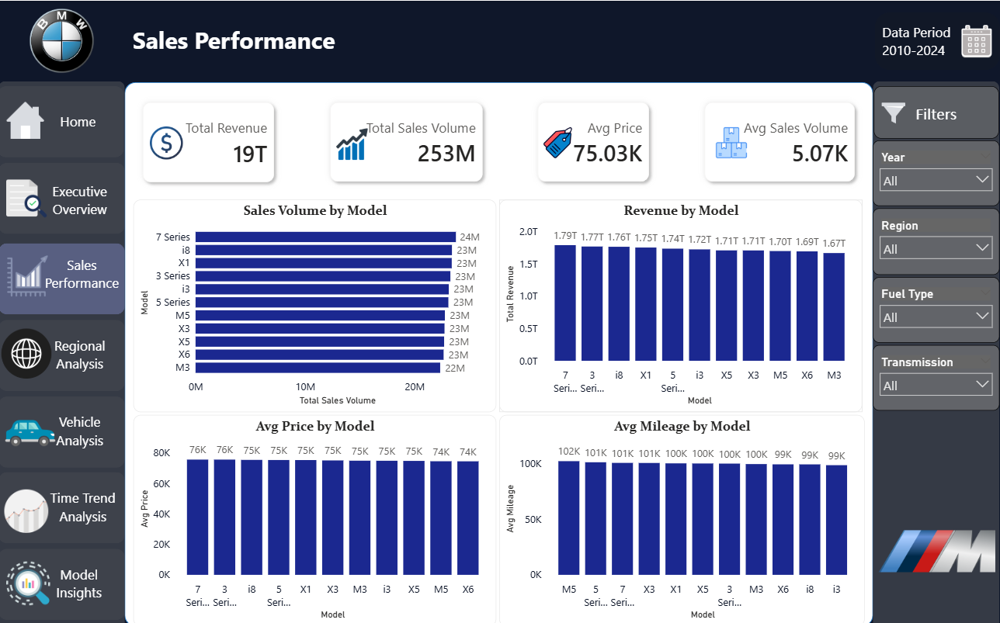
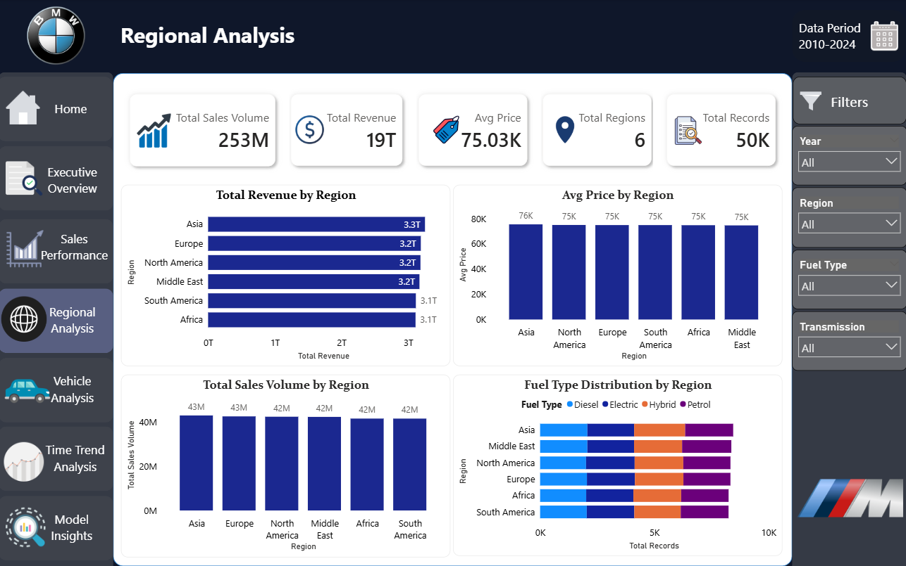
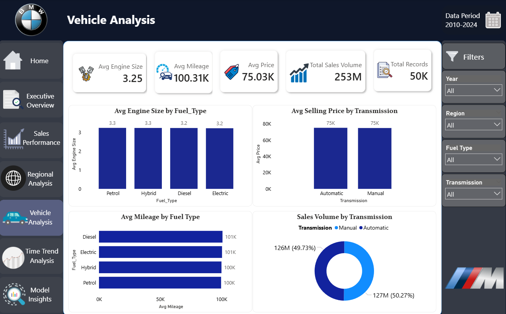
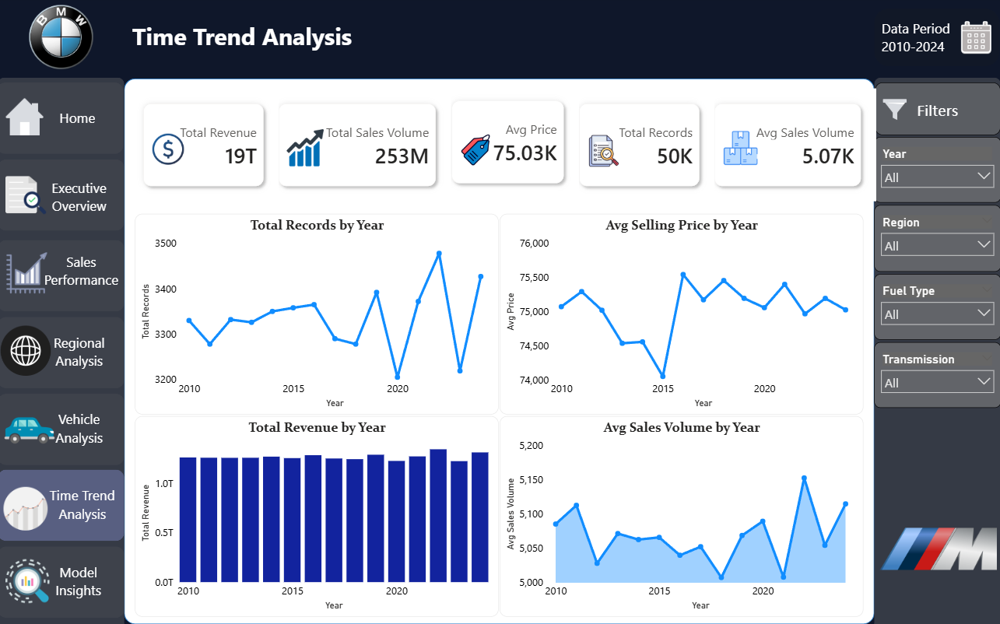
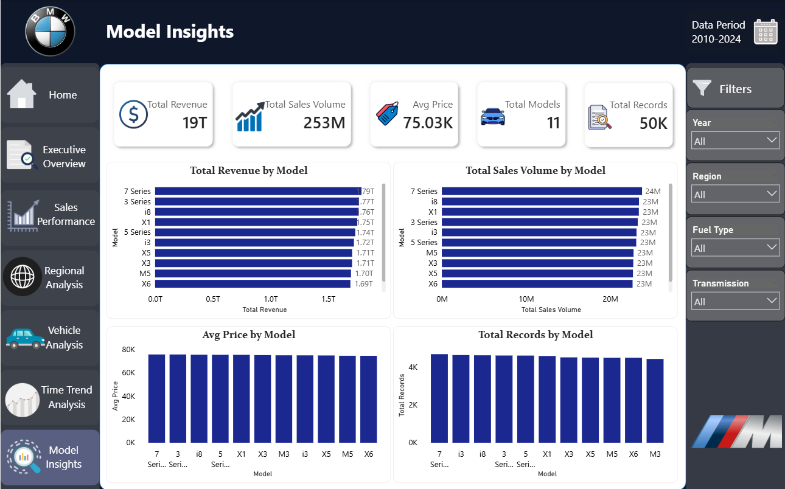

<h1 align="center">🏎️ BMW Sales Analytics Dashboard</h1>

<h3 align="center">
End-to-End Data Analytics & Business Intelligence Project
</h3>

Analyze BMW sales performance from <b>2010–2024</b> using <b>Python, PostgreSQL, SQL, and Microsoft Power BI</b>. This project demonstrates a complete Business Intelligence workflow by transforming raw sales data into interactive dashboards that support data-driven business decisions.

  
  
  
  
  
  

  

  

---

## 📌 Project Overview

The **BMW Sales Analytics Dashboard** is an end-to-end Business Intelligence project that demonstrates the complete data analytics workflow, from data preparation to interactive dashboard development.

Using a BMW sales dataset covering **2010–2024**, the project analyzes sales performance, revenue trends, regional distribution, vehicle specifications, and customer preferences. Python was used for data validation, PostgreSQL and SQL for business analysis, and Microsoft Power BI for creating an interactive multi-page dashboard.

The dashboard enables users to monitor key performance indicators (KPIs), compare BMW models, evaluate regional performance, analyze vehicle characteristics, and identify sales trends to support data-driven decision-making.

---

## 🎯 Business Problem

Large sales datasets often contain valuable business information, but identifying meaningful trends through raw data alone is time-consuming and inefficient.

This project addresses that challenge by transforming BMW sales data into an interactive Business Intelligence dashboard that enables users to monitor sales performance, compare regions, analyze vehicle characteristics, and make informed business decisions through dynamic visualizations.

---

## 🎯 Objectives

- Analyze BMW sales performance from **2010–2024**
- Compare sales across different BMW models
- Evaluate regional sales performance
- Analyze fuel type, transmission, engine size, and mileage trends
- Build an interactive Power BI dashboard with dynamic filtering
- Generate meaningful business insights for decision-making

---

## 🛠 Tech Stack

| Technology | Purpose |
|------------|---------|
| 🐍 Python | Data validation and preprocessing |
| 🐼 Pandas | Data loading, cleaning, and analysis |
| 🗄 PostgreSQL | Database management and storage |
| 💻 SQL | Business queries and analytical insights |
| 📊 Microsoft Power BI | Interactive dashboard development |
| 📈 DAX | KPI calculations and dynamic measures |
| 🌿 Git | Version control |
| 🐙 GitHub | Project hosting and collaboration |

---

## 📂 Dataset Information

| Attribute | Details |
|-----------|---------|
| **Dataset** | BMW Sales Data |
| **Source** | Kaggle |
| **Time Period** | 2010–2024 |
| **Total Records** | 50,000 |
| **Total Features** | 11 |
| **Format** | CSV |
| **Database** | PostgreSQL |
| **Domain** | Automotive Sales Analytics |

---

## 🔄 Project Workflow

The project follows a complete end-to-end analytics workflow from raw data preparation to business insight generation.

  

---

## 📊 Dashboard Preview

The dashboard consists of **7 interactive pages**, each designed to provide insights into different aspects of BMW sales performance. Users can explore KPIs, sales trends, regional performance, vehicle characteristics, and model comparisons through dynamic visualizations.

| Home | Executive Overview |
|------|--------------------|
|  |  |

| Sales Performance | Regional Analysis |
|-------------------|-------------------|
|  |  |

| Vehicle Analysis | Time Trend Analysis |
|------------------|---------------------|
|  |  |

| Model Insights |
|----------------|
|  |

## 🗄 SQL Analysis

SQL was used to answer key business questions and generate insights from the BMW sales dataset. The SQL queries formed the foundation for the KPIs and visualizations used in the Power BI dashboard.

The analysis included:

- Sales performance analysis
- Regional sales comparison
- Model-wise performance analysis
- Average selling price analysis
- Revenue calculation
- Vehicle specification analysis
- Time-based sales trend analysis

---

## 💡 Key Business Insights

- Identified the top-performing BMW models based on sales volume.
- Compared regional sales performance to highlight high-demand markets.
- Evaluated average selling prices across different BMW models.
- Analyzed the relationship between engine size and vehicle pricing.
- Measured average mileage and engine specifications across the product lineup.
- Tracked yearly sales trends to identify business performance patterns.

---

## 🚀 Skills Demonstrated

- End-to-End Data Analytics
- Data Cleaning & Validation
- Exploratory Data Analysis (EDA)
- SQL Query Development
- PostgreSQL Database Management
- KPI Development using DAX
- Interactive Dashboard Design
- Business Intelligence Reporting
- Data Visualization
- Git & GitHub Version Control

---

## 🔮 Future Improvements

- Integrate real-time sales data
- Develop predictive sales forecasting models
- Implement customer segmentation analysis
- Apply Machine Learning for sales prediction
- Publish the dashboard through Power BI Service

---

## 📜 License

This project is licensed under the **MIT License**.

---

## 👨‍💻 Author

**Pratham Meena**

Aspiring Data Analyst | AI/ML Enthusiast

If you found this project helpful, consider giving it a ⭐ on GitHub.
